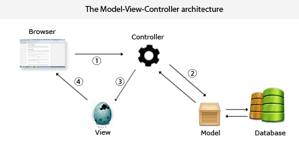

# MVC for python



MVC模式的学习，本学习例子重点关注如何将Model与View分离，参考Web-MVC结构（上图，本例将Browser和View统称为View），Controller主要作用于连接View与Model，就算没有View/Controll的代码，Model也应该是完整的，虽然操作起来会相对麻烦一些，但是只要我们知道Model的API，依然能正常运行这个程序。

虽然本程序的Model部分只是return了一个字符串进行测试，但我认为已经足以表达我所关注的重点：**如何在保证View与Model分离的情况下将View的input传给Model，并从Model得到output输出到View。**

---

- View Class
  - GUI设计导入(存放于View/Window/)，可以使用wxFormBuilde快速生成图形化界面
  - GUI各控件所用到的参数设置和获取值接口的封装
  - GUI的初始化接口
  - GUI控件事件绑定以及回调函数的设置
  - 考虑到控制台(View/Console/)输出也归类到View，控制台初始化/输出的接口封装，暂时没添加控制台input交互
  - View/Window/目录除了会存放已经设计好的GUI之外，还可以添加其他酷炫的动态效果设计
  - View/Console/目录功能和View/Window目录功能一样，如果觉得简单的print()太单调，可以自行封装酷炫的输出方式，在View/View.py中调用


- Model Class
  - 各项业务功能的导入(如：Model/Test/)，可以完全独立编写该业务所需要完成的功能，封装API给Model/Model.py进行各项功能间的复杂逻辑处理
  - 进行复杂逻辑的编写，封装对应API，不依赖于子目录外的其它文件
  - 输出接口与回调函数的设置接口，用以提供给Controll直接使用

- Controller Class
  - 并没有太严格的与Application进行区分，首先进行常规的入口参数检查，并且做好用法帮助提示输出
  - 实例化View与Model
  - 编写输入与输出的回调函数 - do_work() 和 finish()
  - 将Model输入的回调函数绑定到触发任务的View控件对应事件
  - 将View输出的回调函数绑定到Model的输出

---

> 目录结构  (20181124)

```tree
├─Model
│  ├─Test
│  │  └─test.py
│  └─Model.py
└─View
│  ├─Console
│  ├─Window
│  │  └─WindowMain.py
│  └─View.py
├─main.py
└─Controller.py
```

---

> 参考链接：

[到底什么是MVC？](https://blog.csdn.net/sinat_37212928/article/details/78038312?locationNum=2&fps=1)

[wxpython 与 mvc](https://blog.csdn.net/u010798296/article/details/54949613)